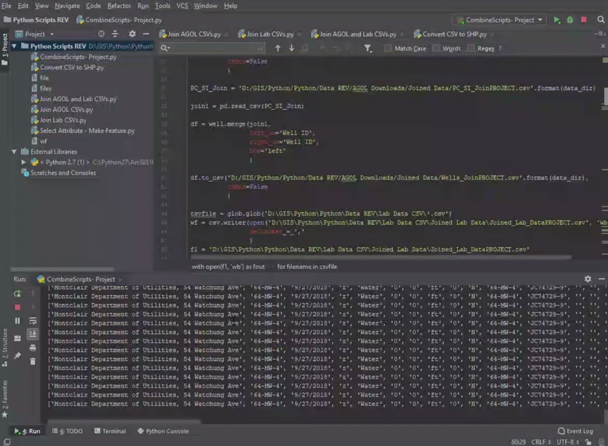

# {Caitlin, just add a project name}

[](https://www.youtube.com/watch?v=9FM82kQdqdM)
*Video on YouTube*


### Python Dependencies
	pip install pandas
	pip install glob
	pip install csv
	pip install numpy 
	pip install arcpy
	arcpy.CheckOutExtension("Spatial")

### Project Description 

I created a geodatabase that stores the data for all our groundwater sampling events for a specific client. The geodatabase was originally created using ArcCatalog, published as a Web Servvice to ArcGIS Online, and accessed in the field via Collector for ArcGIS. 

The data collected from these groundwater sampling events has to be later downloaded and sent to a new geodatabase as each sampling event will get its own. The two data tables associated with the "well" point feature class have to be joined together (the purge chemistry and the sampling information tables) and later joined to the well csv file (Step 1 - 3 CSVs merged to 1 - this is used as a reference and not included in the continuing steps).

Next, I have to download the lab data that was provided to us as three CSVs (Step 2 - Merege Lab Data CSVs). Then, I link the original "well" CSV with the combined lab data (Step 3). Note: I do not need to use the combined CSVs aquired from Step 1. Once the well CSV is merged with the Lab Data based on the common identifier, I need to pick out the parameters that exhibit exceedances as according to the state regulations (Step 4). 
I would like to pick out all exceeding well locations and associated data that specifically exceeds the "Benzene" regulations, convert the  features to a shapefile, and save to the geodatabase (Step 5). Finially, I would like to interpolate as IDW and show on ArcMap (Step 6).

### Project Outline

```
Join Purge Chemistry and Sampling Information
	call locations
	allow pandas to read
	merge purge chemistry (pc) CSV to sampling information (si) CSV
	convert to csv
  
  	call on converted csv
	allow pandas to read
	merge with wells CSV
	convert to csv
  
 Join Lab Data CSVs Together
 	define parameters
	create function for file in csvfile
		read csv
		write rows
		
	save header of one csv to be showin in output CSV
		with csv
			keep header
			if there is a header in the others
				ignore

 Join Lab Results CSV and Wells CSV
 	set parameter locations
	allow pandas to read CSVs
	merge lab results CSV with wells CSV
	
	Compare State Groundwater Regulations with Lab Results column in table
		list chemical standards and values
		create function
			if data frame exceeds chemical standards = "exceed"
			if data frame does not exceed chemical standards = "good"
			
		create new data frame with selected columns (flagged)
		convert to csv
		
Convert Well & Lab Data Join CSV and the Flagged Lab Data to Shapefile
	define table locations
	MakeXYEventLayer (table1)
	CopyFeatures (table1)
	MakeXYEventLayer (table2)
	CopyFeatures (table2)
	FeatureClassToGeodatabase (table1)
	FeatureClassToGeodatabase (table2)
	
Select Attributes in Flagged Lab Data Shapefile to Display Exceedances Only & Select Parameters to Show Benzene Exceedances Only
	define workspaces, file locations, parameters, and queries
	flagged lab data:
		MakeFeatureLayer 
		SelectLayerByAttribute (exceedance query)
		CopyFeatures
		FeatureClassToGeodatabase
	benzene exceedance only
		MakeFeatureLayer 
		SelectLayerByAttribute (benzene exceedance query)
		CopyFeatures
		FeatureClassToGeodatabase
		
Create a IDW Interpolation of Benzene Exceedances
	gp.Idw_sa(Benzene Exceedance SHP, "Value", IDW Location, "cell size", "VARIABLE 12")
	
```
